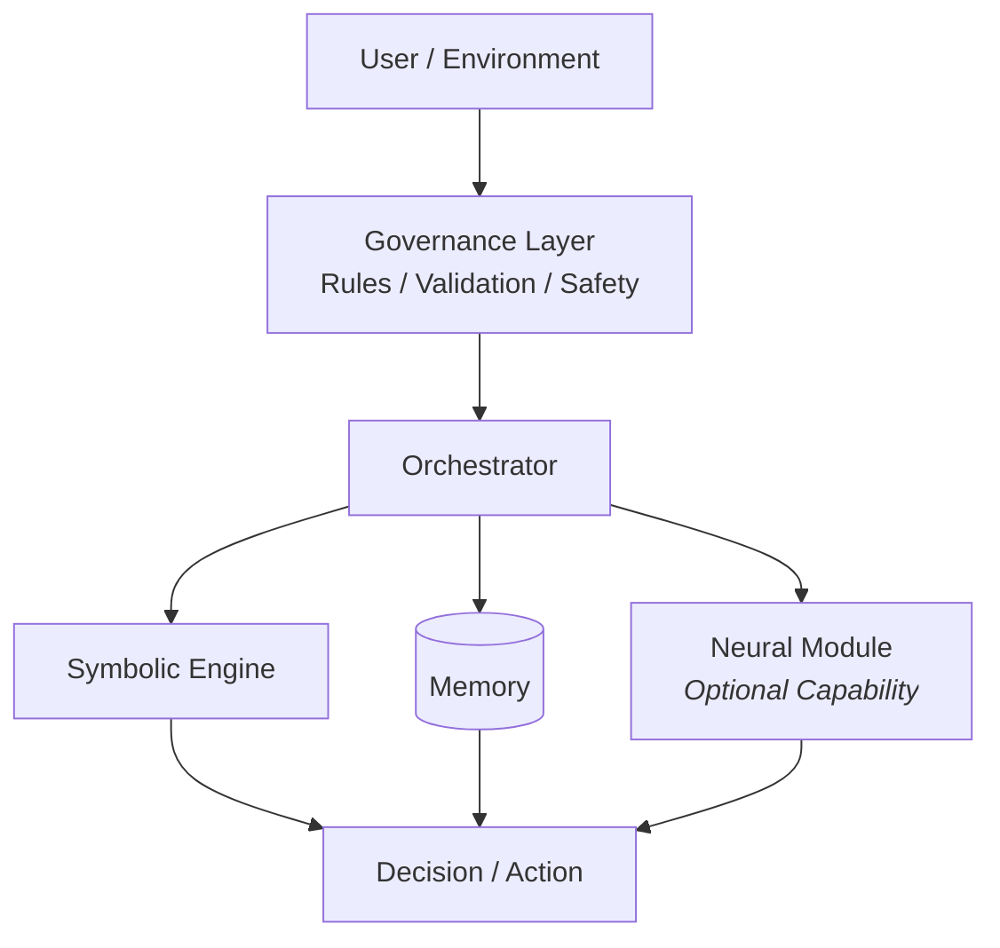

## 📁 Project Structure & Reading Guide

To explore ELIA, the following reading order is recommended:

1. **[Project Overview](README.md)**  
   High-level vision and positioning.

2. **[Development Guide](README.DEV.md)**  
   How the MVP translates the vision into code.

3. **[Long-Term Vision](README.VISION.md)**  
   Architectural goals and future direction.

4. **[Architecture Specification](docs/EL-ARCH.md)**  
   The complete technical blueprint.

5. **[Contact & Support](CONTACT.md)**  
   How to reach out or contribute.

# Elia — Governed Hybrid Cognitive Architecture

> **Status:** Experimental / Architecture Design Phase  
> **License:** Apache 2.0

Elia is an open-source architecture for building **reliable, auditable, and resilient intelligent systems**.

Rather than centering intelligence entirely around Large Language Models (LLMs), Elia introduces a governed, hybrid approach in which symbolic control and system-level supervision remain primary, and neural models are used only when appropriate.

## Architecture Overview

Elia can be understood as an **AI Operating System**: a structured environment where intelligence is orchestrated, monitored, and constrained rather than left implicit.

---

## Vision

Most contemporary AI systems prioritize generative performance over control. As a result, they often become opaque, fragile, and difficult to govern once deployed.

Elia takes a different path.

It is designed to ensure that intelligent behavior remains:
- **Predictable**, even under degraded conditions
- **Auditable**, with explicit separation between observation, decision, and execution
- **Resilient**, capable of continuing to operate when neural components fail or are intentionally disabled

Neural intelligence is treated as a **capability**, not an authority.

---

## Core Principles

- **Governed Intelligence**  
  All critical decisions are made under explicit symbolic control. Neural models never operate autonomously.

- **Hybrid by Design**  
  Symbolic logic ensures stability and safety, while neural networks provide flexibility and expressiveness when conditions allow.

- **Graceful Degradation**  
  The system is designed to remain operational even when neural inference becomes unreliable, unavailable, or unsafe.

- **Clear Separation of Concerns**  
  Observation, monitoring, decision-making, and execution are isolated to prevent hidden feedback loops and unintended behaviors.

---

## What Elia Is Not

To avoid ambiguity, Elia explicitly defines what it is not:

- It is **not an Artificial General Intelligence (AGI)**.
- It is **not a chatbot framework or LLM wrapper**.
- It is **not a self-directing or self-authorizing system**.
- It is **not a black box**.

---

## Intended Audience

Elia is intended for:

- System architects and engineers working on AI-enabled systems
- Developers interested in alternatives to LLM-centric agents
- Researchers exploring hybrid (symbolic + neural) AI
- Teams operating in constrained, regulated, or reliability-critical environments

---

## Project Status

This repository currently provides an **architectural specification**, not a production implementation.

The architecture is described in detail in:

- **docs/EL-ARCH.md** — Complete system specification (recommended for technical readers)

A separate development-oriented document defines how the project may transition toward an initial prototype.

---

## Contributing

Elia is an open research initiative.

We welcome discussions and contributions from individuals interested in:
- AI governance
- System resilience
- Hybrid cognitive architectures
- Long-term maintainability of intelligent systems

Please refer to README.DEV.md for information on how the project approaches an initial prototype.

---

Elia explores a simple but demanding idea:  
**intelligence should be powerful, but never ungoverned.**

